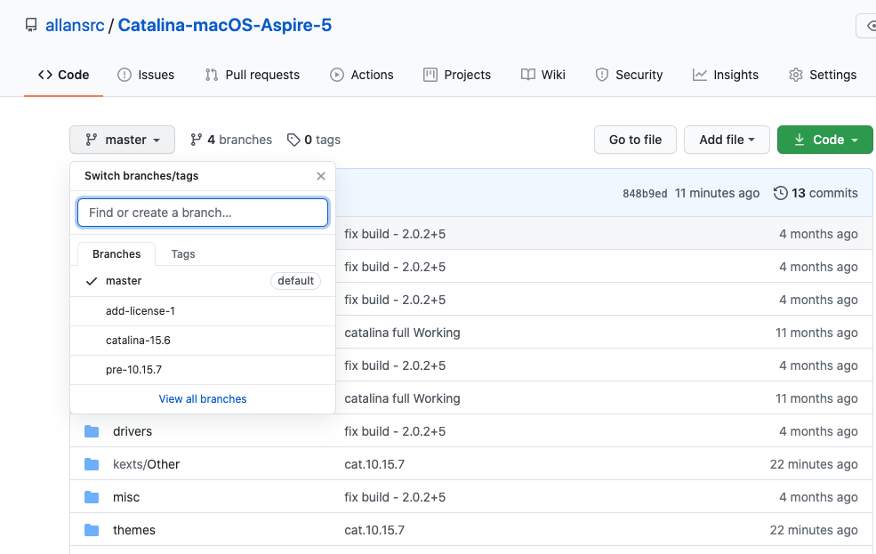

#
# Acer Aspire A515-51G

### >>>: Disclamer (updater)

- This branch is a pre-build for opencore and BigSur (11.0), so if you use **master branch** You'll need:
- - update Clover to 5122 or newer,
- - boot from "**_pre boot_**" on Clover. To do that, press **F3** then select preboot drive,

- If You are on version <= 10.15.6 clone or Download **catalina.15.6 branch**
  

### >>>:

- _CPU_ : Intel Core i5-8250U (base 1.6GHz, boost 3.6GHz, syntetic load stable 2.4GHz, cinebench 1200pts)
- _RAM_ : 4GB DDR4 unknown soldered onto the motherboard, 4GB DDR4 ADATA 2400MHz
- _GPU_ : Intel UHD Graphics 620 2048MB
- _dGPU_: NVidia MX130 2048mb (disabled using DSDT patches)
- _HDD_ : Western Digital Blue 01984 1TB
- _AUD_: : ALC 255 layout-id: 31 / layout-id: 3 (try both and decide which one is more stable for your setup)
- _WIFI_ : Dungle TP-Link 725N

### what is not working:

1. Wi-Fi card (You will need to replace it to the oe that's compatibile - DW1560 will do.)
2. OOB combojack ([FIX AVAILABLE](https://github.com/hackintosh-stuff/ComboJack))
    Note: If you want to use combojack and only internal mic - use layout 3. If you want to use headset use layout 31.


### WARNINGS:

- Default Wifi card **DOES NOT** work under MacOS and will never do. Bluetooth might work - but it's power managament is not supported, so you are stuck with always on BT.

### Post installation

If you are using an SSD make sure to enable the TRIM support:

```

$ sudo trimforce enable

```

## !After installing clover rebuild kext caches and kernel cache then!

### reboot and enjoy!

### Credits:

[Base Mojave EFI Fold](https://github.com/h-okon/Acer-Aspire-A515-Hackintosh)

[Clover EFI Bootloader](https://github.com/Clover-EFI-Bootloader/clover)

[Lilu.kext](https://github.com/acidanthera/Lilu/releases)

[VoodooPS2](https://github.com/RehabMan/OS-X-Voodoo-PS2-Controller)

[VoodooI2C](https://github.com/alexandred/VoodooI2C)

[Disable MX130](https://www.tonymacx86.com/threads/guide-disabling-discrete-graphics-in-dual-gpu-laptops.163772/)
